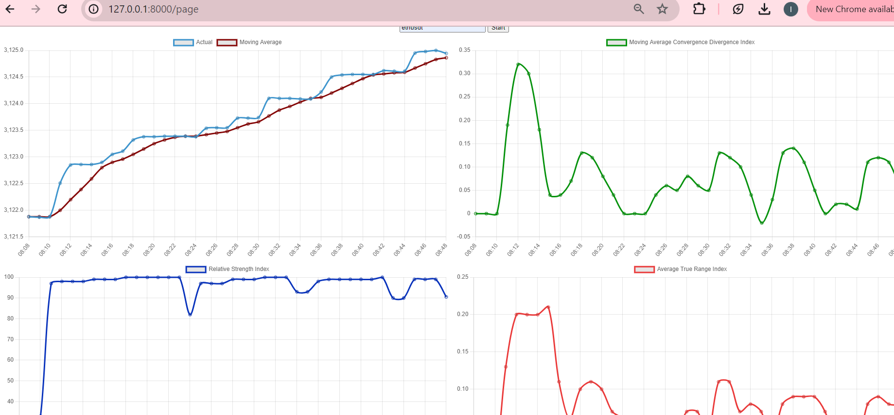

# A Real-Time Stock Data Streaming Application
In financial settings like day-trading, one would need to make decisions swiftly
as markets change and new information becomes available. This web application 
enables a user to stream stock data from the Binance API using websocket connections
and track select indicators calculated in real time.

HTML, CSS, JAVASCRIPT are used to build the frontend and FastAPI for the backend

# Getting Started
To explore and experiment with the web application on your computer follow
the following instructions

# Create a virtual environment
Ensure you have Python with `pip` installed
`python3 -m venv .venv`

# Activate the virtual environment
`source .venv/Scripts/activate`

# Install dependencies
The required packages are in the **requirements.txt** file.
Install all of them with:
`pip install -r requirements.txt`

# Run the application
Execute the following command in the terminal:
`python3 -m app`

# Interact with app
On a browser, navigate to 127.0.0.1:8000/page

# Start stream
Enter your stock item like **BTCUSDT** and click **Start**
